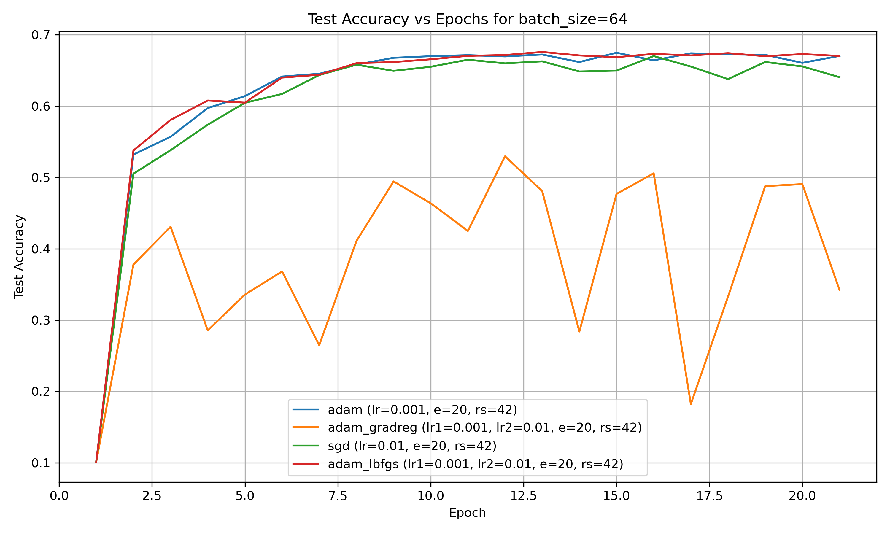

# Alternating Optimization for Neural Network Training

## Overview

This project explores an **alternating optimization approach** for training neural networks. We apply:
- **First-order methods** for the majority of layers.
- **Second-order updates** for the final layer.

### Key Highlight:
- **Faster Convergence with Second-Order Methods**: Second-order methods significantly reduce the number of epochs needed to achieve better results. However, they are more computationally intensive than first-order methods and require more hyperparameters to tune.

### Results

#### Matrix Factorization
Here are results for **Matrix Factorization**


#### Attention Layer
Results for **Attention Layer** optimization


#### LeNet-5 Training
Here is an example result for **LeNet-5 Training** 



---
## Requirements

- All required Python packages can be found in `requirements.txt`. Install by using:
  ```bash
  pip install -r requirements.txt

## Running the Code

The experiments can be executed using the `run.py` or `run_lenet.py` files depending on the experiment. For convenience, bash scripts are also available to automate common tasks.

### Syntax
- For Matrix Factorization or Attention Layer experiments:
  ```bash
  python run.py --experiment <experiment_name> --config <path_to_config_file>
For the matrix factorization it is possible to provide your own dataset as .h5 file, otherwise a list with random matrices will be used.

- For LeNet-5 Training:
  ```bash
  python run_lenet.py --config <path_to_config_file>

### Examples
- To run Matrix Factorization with adam and gradreg methods:
  ```bash
  python run.py --experiment matrix_factorization --config configs/matrix_factorization/adam+gradreg.yaml
  
- To run Attention Layer optimization with gradient descent:
  ```bash
  python run.py --experiment attention_layer --config configs/attention_layer/attention_GD.yaml

- To run LeNet-5 Training with Adam using the full-batch configuration:
  ```bash
  python run_lenet.py --config configs/lenet5/full_batch/lenet5_adam.yaml

### Some Useful Bash Scripts 
 Bash scripts to streamline experiments can be found in the scripts/ folder. In particular, use run_batches.sh to execute LeNet-5 Training with different batch sizes.

### Results Directory
All experimental results are saved in the results/ directory with filenames corresponding to the specific experiment. 
